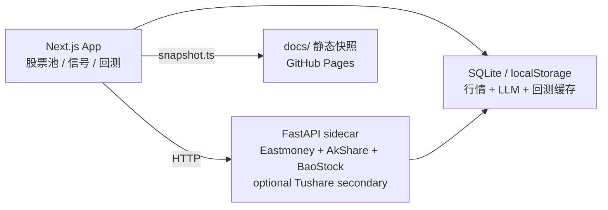

# topkyo · AI 基建研究台

面向中国 A 股 AI 基建主题的个人研究仪表盘，聚焦算力芯片、光模块、AI 服务器、液冷、电力、IDC、存储、半导体设备与材料等供给侧方向。项目用于维护股票池、查看行情与一致预期参考、生成 LLM 策略信号，并做滚动回测。

> 个人研究工具，不构成任何投资建议。<br>
> 基于 [madeye/silicon-civilization-stock-trade](https://github.com/madeye/silicon-civilization-stock-trade) fork 后定制。

静态展示页：<https://topkyo.github.io/topkyo-ai-infra-dashboard/>

## 核心能力

| 能力 | 说明 |
|---|---|
| AI 基建股票池 | 按产业环节维护 A 股主题标的，数据源为 [web/data/universe.json](web/data/universe.json)。 |
| 行情与一致预期 | FastAPI sidecar 聚合现价、估值、成长、评级和隐含目标参考。 |
| LLM 策略信号 | 全池生成 `buy` / `hold` / `sell` 信号；失败时显式不可用，不合成伪结论。 |
| 严格回测 | 按调仓周期重配，支持基准指数、单边费率、信号缓存和结果存档。 |
| 静态快照 | 输出 `docs/data/*.json`，用于 GitHub Pages 公开展示最近一次研究快照。 |

## 产品界面

- `/`：股票池总览，展示主题、现价、一致预期参考、数据来源和刷新入口。
- `/signals`：流式生成实时 LLM 信号，先展示加载进度，再展示 live/cache 结果或失败原因。
- `/backtest`：配置日期、调仓周期、最大持仓和基准指数，运行严格回测。
- `docs/`：无需服务端和 API key 的静态快照页面。

## 架构



项目结构：

```text
web/       Next.js 15 App Router、API routes、LLM 策略、回测、测试
pyserver/  FastAPI 市场数据 sidecar，免费源优先，Tushare 可选次级源
docs/      GitHub Pages 静态快照页面、数据和部署说明
scripts/   本地运维、macOS launchd、Node 原生模块辅助脚本
```

品牌文案集中在 [web/lib/site.ts](web/lib/site.ts)，视觉规范见 [DESIGN.md](DESIGN.md)。

## 数据与策略原则

- **免费源优先**：A 股行情与基本面优先使用 Eastmoney / AkShare / BaoStock；Tushare 默认关闭，只在 `MARKET_ENABLE_TUSHARE_SECONDARY=1` 且提供真实 token 时作为补缺源。
- **来源可审计**：sidecar 响应通过 `source`、`warnings`、`field_sources` 暴露字段来源和非实时/缺字段等状态。
- **不伪装实时价**：Eastmoney / 新浪实时 quote 不可用时，可能返回 AkShare `stock_value_em` 或日线最近收盘，并明确标注为非实时参考。
- **LLM 是交易结论源**：规则特征只给 LLM 提供可审计输入，`buy` / `hold` / `sell` 必须来自 LLM 输出。
- **严格失败语义**：K 线不足、benchmark 缺失、LLM 超时、输出缺失/重复/未知代码/非法 action 等硬依赖失败时，API/UI 显式报错，不生成 synthetic hold，不存失败回测结果。
- **股票池刷新不静默成功**：LLM 刷新失败不写文件；LLM 返回空 proposal 可成功返回但不改 `updated_at`；只有真实新增、移除或改类才更新股票池文件。

## LLM 工作流

| 场景 | 路由 / 脚本 | 关键行为 |
|---|---|---|
| 实时信号 | `/api/signals` | 对全池按 `SIGNALS_LLM_SCORE_BATCH_SIZE` 串行分批；模型 `LLM_MODEL`；route `maxDuration = 3600`。 |
| 回测 | `/api/backtest` | 每个调仓日对全池打分；`BACKTEST_SIGNAL_CONCURRENCY` 并行调仓日，日内按 `BACKTEST_LLM_SCORE_BATCH_SIZE` 串行分批；route `maxDuration = 3600`。 |
| 股票池刷新 | `/api/universe/refresh` | 单次 LLM 审阅整池并提出增删改；`UNIVERSE_REFRESH_LLM_TIMEOUT_MS` 控制提议阶段；route `maxDuration = 900`。 |
| 静态快照 | `web/scripts/snapshot.ts` | 生成股票池、分析师、信号和回测 JSON；可用 `SNAPSHOT_SKIP_SIGNALS=1` / `SNAPSHOT_SKIP_BACKTEST=1` 跳过重任务。 |

LLM 响应按 prompt + model 哈希缓存到 `web/.cache/web.db`，约 12 小时。同参数重复跑信号或回测会复用缓存，但缓存命中不改变严格校验规则。

完整变量表和调优建议见 [docs/OPERATIONS.md](docs/OPERATIONS.md)。

## 本地启动

### 1. 启动 pyserver

```bash
cd pyserver
cp env.example .env
# 免费真实数据无需 Tushare token；如需 Tushare 补缺，再设置 TUSHARE_TOKEN 和 MARKET_ENABLE_TUSHARE_SECONDARY=1
uv sync
uv run uvicorn main:app --port 8001 --reload
```

### 2. 启动 Web

Node 版本由仓库根目录 [`.nvmrc`](.nvmrc) 锁定。`better-sqlite3` 是原生模块，必须与运行时 Node 主版本一致，否则 `/api/signals` 等路由可能 HTTP 500。

推荐一次性配置 direnv，让进入仓库时自动 `nvm use`：

```bash
./scripts/setup-direnv.sh
```

手动启动：

```bash
nvm install
nvm use
cd web
npm install
cp env.example.txt .env.local
# 配置 OPENCODE_GO_API_KEY 或 DEEPSEEK_API_KEY
npm run dev
```

打开 <http://localhost:3000>。

## 常用命令

| 目的 | 命令 |
|---|---|
| Web 单元测试 | `cd web && npm test` |
| Web 类型检查 | `cd web && ./node_modules/.bin/tsc --noEmit` |
| 生产构建 | `cd web && npm run build` |
| 刷新股票池 | `cd web && npx tsx scripts/refresh-universe.ts` |
| 生成静态快照 | `cd web && npx tsx scripts/snapshot.ts` |
| 本地监控日志 | `./scripts/monitor-dashboard.sh` → `tail -f .monitor/logs/current.log` |
| 本地预览静态页 | `python3 -m http.server 8765 --directory docs` |

不要在同一工作区同时运行 `npm run dev` 和 `npm run build`。

## 文档导航

| 文档 | 用途 |
|---|---|
| [docs/OPERATIONS.md](docs/OPERATIONS.md) | 本地运行、环境变量、缓存、LLM 调优、常用排障。 |
| [docs/RESEARCH_ASSISTANT_ROADMAP.md](docs/RESEARCH_ASSISTANT_ROADMAP.md) | 个人研究辅助定位与下一阶段开发方向。 |
| [docs/DEPLOY.md](docs/DEPLOY.md) | Docker Compose / VPS 部署完整交互应用。 |
| [docs/README.md](docs/README.md) | GitHub Pages 静态快照说明。 |
| [pyserver/README.md](pyserver/README.md) | 市场数据 sidecar、端点、数据源优先级和响应元数据。 |
| [scripts/macos/README.md](scripts/macos/README.md) | macOS launchd 本地系统服务。 |
| [docs/TUSHARE-PERMISSIONS.md](docs/TUSHARE-PERMISSIONS.md) | Tushare 次级源权限参考。 |

## 安全

- 不提交 `.env`、`.env.local`、`cache.db`、API key。
- LLM key 只放在 `web/.env.local` 或部署环境变量。
- Tushare token 只放在 `pyserver/.env` 或部署环境变量。
- `docs/data/*.json` 是公开静态快照，包含研究输出，只适合作为可公开研究记录。
